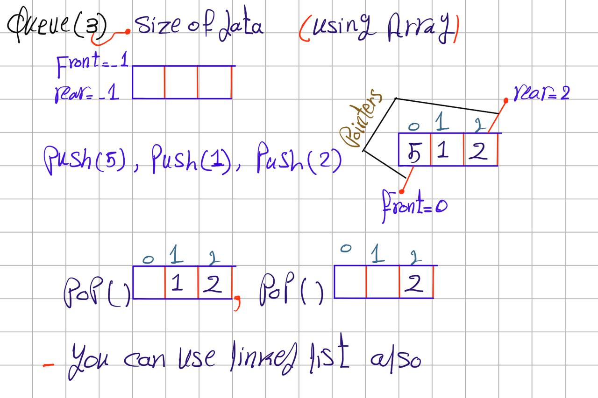

## Queue

### Definition
A **queue** is a linear data structure that allows you to add items at the rear (end) and remove items from the front (beginning). The first item you put in is the first one you take out. This is called **First In, First Out (FIFO)**.

### Visual Representation

*This is called a Simple Queue.*

### Basic Operations
- **Enqueue:** Add an item to the rear of the queue.
- **Dequeue:** Remove an item from the front of the queue.

### Limitation of Simple Queue
If you create a queue of size 3 and fill all positions, then dequeue (remove) an item, there is an empty space at the front. However, you cannot add a new item unless you shift all elements, because the rear pointer is at the end. This wastes space.
To solve this, we use a **Circular Queue**. In a circular queue, when the rear reaches the end of the array, it wraps around to the beginning if there is space. This makes the queue refillable and efficient.

**Key Point:**
- When `rear == size - 1` and there is space at the front, set `rear = 0` to reuse the space.
- This changes the logic in the code—see the implementation for details.

---
*For more details, check the code examples in this folder.*

---
There is a third type of Queue called **Priority Queue**, we will discuss it after the Tree Data Structure.
