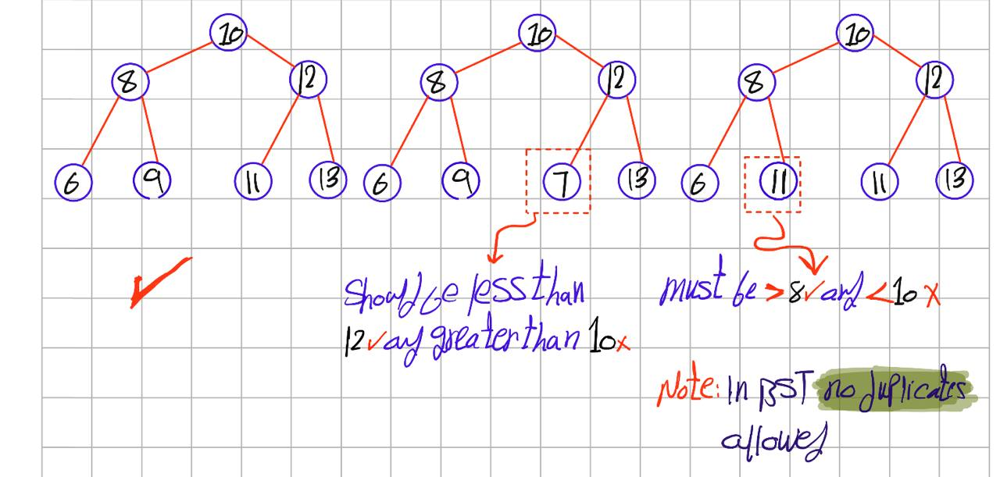

# Binary  Tree 
## Definition :
Binary tree is a tree where each node can have a maximum of two child nodes, left and right.
---

## Types 

We can +- binary tree structures according to three main principles: 
+ The number of children each node has 
+ How complete the levels of the tree are 
+ The values stored in the nodes. 

Each principle leads to several distinct types of binary trees, in this repo we will foucuse on complete levels of the tree and values stored in the nodes.

#### Types of Binary Tree based on completion of levels which are Complete,Perfect,Balanced Trees:  
+ 1- Complete BT occur when all the levels are completely filed **except** possibly the last level which is filleld from **left to right** 
  + Visualization 
+ 2- Perfect BT occur when all the internal nodes have two         children and all leaf nodes are at the same level.
  + Visualization 

+ 3-Balanced BT occur when the difference between the height of the left and the right subtree for each node is either 0 or 1.
  + Visualization 
 
### Note: Most operations in a Binary Tree take O(n) time, since there is no ordering among nodes.This limitation leads us to a new classification of trees that use node values to impose ordering, such as the Binary Search Tree (BST).
---------------
#### Types of Binary Tree based on node values Binary Search ,AVL, Red Black, B+, Segment Trees in this repo we will discuss the Binary search and avl Trees  
+ Binary Search Tree(BST) is a node-based binary tree that has those properties 
  + left subtree of a node has only nodes with kays **less** than node's key.
  + right subtree of a node has only nodes with kays **greater** than node's key.
  + Both the left and right subtrees **must** also be binary search trees.
     + Visualization 
       + Most operaion in BST takes $O(h)$ time, h is the hight of the tree. This is better than $O(n)$.

+ AVl and we will discuss this type in separate file.
